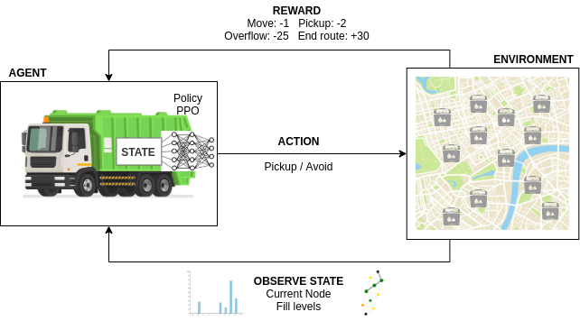
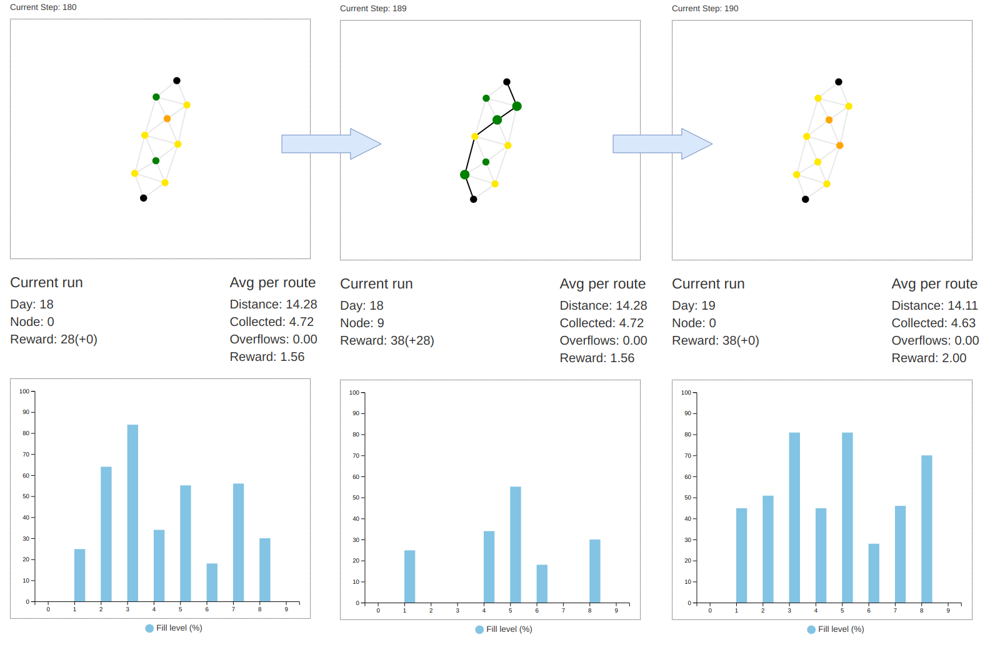

# Deep Reinforcement Learning for Smart Cities


## Documentation

RLlib: https://docs.ray.io/en/master/rllib.html

Mesa: https://mesa.readthedocs.io/en/stable/


## Installation

Clone repository and install dependencies.

```
git clone git@github.com:eescriba/smart-cities-drl.git
cd smart-cities-drl
python3 -m venv venv
source venv/bin/activate
pip install -r requirements.txt
pip install -e .
```

## Training

Train environments in Jupyter notebooks with RLlib.

### SmartCab
[](https://colab.research.google.com/github/eescriba/smart-cities-drl/blob/master/notebooks/smartcab.ipynb)
### WasteNet
[](https://colab.research.google.com/github/eescriba/smart-cities-drl/blob/master/notebooks/wastenet.ipynb)




## Simulations

Run and visualize environments with Mesa.
```
mesa runserver src/[env_name]
```

